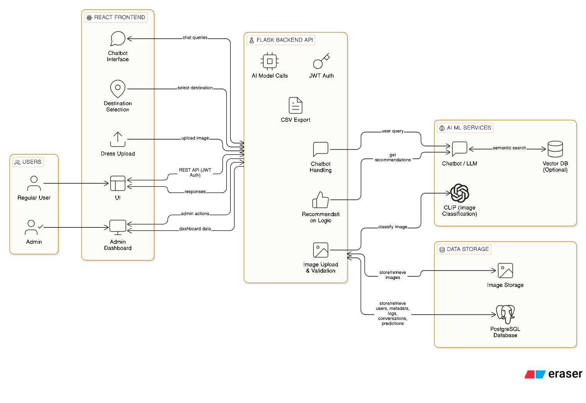

# 👗 AI-Based Dress Classification & Recommendation System

A simple AI-powered web application that classifies dress images, recommends suitable outfits based on destination, and provides an AI chatbot for fashion-related queries.

---

## 📌 Project Overview

This project allows users to:
- Upload dress images
- Get dress classification using an AI model
- Receive destination-based outfit recommendations
- Interact with an AI chatbot for fashion advice

---

## 🏗️ System Architecture

**Description:**
- Users interact with the system through a React frontend.
- The frontend communicates with a Flask backend using REST APIs.
- The backend handles image uploads, recommendations, and chatbot requests.
- A CLIP model is used for dress image classification.
- The chatbot uses an LLM and can optionally retrieve context from a vector database.
- PostgreSQL stores structured data and image metadata.

---

## 🚀 Features

- Dress image classification using CLIP
- Destination-based dress recommendations
- AI chatbot for user queries
- Admin panel with CSV export
- PostgreSQL database support

---

## 🛠️ Tech Stack

- **Frontend:** React
- **Backend:** Flask
- **AI Model:** CLIP (openai/clip-vit-large-patch14)
- **Chatbot:** LLM-based
- **Database:** PostgreSQL

---
